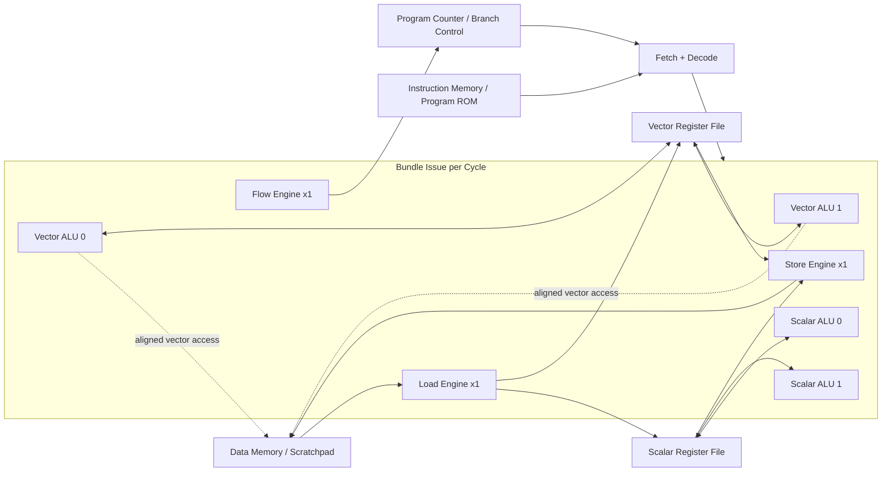

# Vibe Coding Hardware: Rebuilding Anthropic's VLIW SIMD Take-Home as an FPGA-Oriented SoC

I came across Anthropic's original performance take-home through posts on X. The challenge is straightforward to describe but surprisingly deep to solve: optimize machine cycles for a tree-traversal kernel on a VLIW SIMD simulator.

In practice, that means understanding the architecture well enough to schedule instructions so hardware resources stay busy while hazards stay under control.

- Original take-home discussion on X:
  - https://x.com/AnthropicAI/status/2014143403144200234
  - https://x.com/trirpi/status/2014206185994629264
- Original repository/problem reference: https://github.com/anthropics/original_performance_takehome.git
- Project repo (this work): https://github.com/aneesh64/experimental-vliw-simd/tree/main

## Why this problem is interesting

Most developers are used to scalar CPUs like x86-64 or ARM where one instruction stream is dynamically optimized by hardware features like branch prediction, out-of-order execution, and register renaming.

VLIW SIMD flips that model:

- VLIW (Very Long Instruction Word): multiple operations are packed into one bundle.
- SIMD (Single Instruction, Multiple Data): vector operations process many data elements at once.
- Compiler/scheduler heavy: much of the scheduling complexity moves from hardware into software/tooling.

This tradeoff is common in DSP-style systems where predictable throughput matters. You can see this design flavor in products like Qualcomm Hexagon DSP and NVIDIA PVA, and similar ideas appear in modern ML accelerators.

What makes VLIW-SIMD attractive for these workloads is determinism. You can often reason about throughput by counting bundle issue slots, data dependencies, and memory gaps, instead of relying on opaque out-of-order behavior. The downside is that you pay for this in software complexity: code generation/scheduling quality can dominate final performance.

In my case, the architecture is intentionally reduced compared with the original challenge. The execution template I targeted was:

- 2 scalar ALU engines
- 2 vector ALU engines
- 1 load engine
- 1 store engine
- 1 flow/branch engine

That gives enough parallelism to demonstrate real scheduling pressure while staying practical for FPGA bring-up and debug.

## Architecture diagram (current reduced design)

## First experiment: optimize the kernel with GitHub Copilot

Before touching hardware design, I used Copilot to attack the kernel scheduling problem itself.

After trying auto model selection, Claude Opus 4.6, and GPT-5.3-Codex, I ended up around 2002 cycles - well above the best hand-optimized results (sub-1000), but still a useful baseline. I burned roughly 20% of my premium requests and learned a lot about how the models reason about low-level scheduling constraints.

## Main experiment: vibe code the hardware

Since many people were using copilots for software optimization, I wanted to try a different question:

How far can Copilot go in designing the actual VLIW SIMD hardware and verification stack for FPGA targets?

I deliberately avoided micromanaging prompts with my own detailed RTL decisions. Instead, I steered with broad architecture constraints:

- Keep vector memory access aligned.
- Prefer scratchpad access patterns that simplify banked memory mapping on FPGA BRAMs.
- Reduce resource count vs original challenge (for development speed).

## Toolchain choices

Instead of writing RTL directly in Verilog/SystemVerilog, I chose SpinalHDL (Scala-based HDL/DSL):

- More expressive and readable than raw Verilog for this workflow.
- Good built-in support for interfaces like AXI/APB.
- Strong synthesizability guardrails compared to simulation-only Verilog patterns.

Useful references:

- SpinalHDL official docs: https://spinalhdl.github.io/SpinalDoc-RTD/
- SpinalHDL project: https://github.com/SpinalHDL/SpinalHDL
- VexRiscv (well-known SpinalHDL CPU example): https://github.com/SpinalHDL/VexRiscv

For verification I used cocotb in Python with Icarus Verilog as the simulator.

References:

- cocotb docs: https://docs.cocotb.org/
- cocotb repo: https://github.com/cocotb/cocotb
- Icarus Verilog: http://iverilog.icarus.com/

This gave me a productive loop: generate RTL from SpinalHDL, simulate quickly, and validate behavior in Python testbenches.

The practical win with cocotb is testbench ergonomics. For microarchitecture work, it is often faster to express scoreboarding/checking logic in Python than in SystemVerilog UVM-style infrastructure, especially when you are iterating on instruction semantics and memory timing.

## Scope reduction by design

The original optimization environment has significantly more engines (e.g., many scalar/vector units). For this project I constrained the architecture to keep iteration practical:

- 2 scalar ALU engines
- 2 vector ALU engines
- 1 load engine
- 1 store engine
- 1 flow/branch engine
- aligned vector memory/scratchpad accesses

These constraints were intentional: simplify datapath/control complexity first, then grow capability later.

## Initial prompt that kicked off the project

My first serious prompt was essentially:

"The optimization report contains a vliw simd architecture described. We are going to plan the actual hardware units which can be coded up in an RTL language. Come up with a plan to implement this architecture. The end goal is to be able to synthesize the design in an FPGA and run it. The choice for RTL is going to SpinalHDL (it's a high level language which can be used for generating hardware RTL and contains lot of interfaces necessary already as libs). For verification, we are going to use cocotb library (python based). The plan document needs to be split it into multiple modules which will describe the hardware unit, the interface, verification plan, C/C++ model (if necessary) for goldern reference etc. We have some freedom in selecting the instruction encoding. Come up with a plan document, which other coding models can use to create the actual coding (give lots of hints in the document, code samples, and pattern to follow). Browse internet documentation if needed to find out how to use the libraries mentioned. First come up with a plan, we will review it, then once we finalize, you can write it as a design document."

That prompt produced the initial architecture + verification direction that the rest of the work followed.

## What using Copilot felt like in practice

Total Copilot time was roughly 20 hours:

- ~1 hour prompting/steering
- ~19 hours waiting for iterations, bug fixing attempts, and verification turnaround

I started with Opus 4.6 for broad planning and generation, then used GPT-5.3-Codex to stabilize parts of the design on selected tests. Later I switched back to auto model selection because token burn on longer runs was high.

## Reflections on vibe coding hardware

### 1) Speed of inference is now a hard bottleneck

Model quality is strong, but multi-minute think times (sometimes 5-10+ minutes) slow the design loop significantly. Faster inference could materially change hardware/verification productivity.

I also saw repeated circular back-and-forth in model reasoning around cycle-level behavior (for example: what happens at cycle $N$ when an instruction issues at cycle 1, and how cycle 2 side effects propagate). A model would often commit to one assumption, reason for 4-5 minutes, then discard that assumption and restart with a different one. Humans reason this way too, but models are expected to be more explicit and internally consistent here. I expect upcoming models to clear more of this barrier, and I plan to retry with newer releases to fix remaining issues and expand project scope.

### 2) Over-specification can hurt exploration

If every design detail is locked too early, you lose beneficial alternative patterns. Leaving some room in early prompts can produce useful architecture variations.

### 3) Human leverage is shifting

The differentiator is increasingly pattern invention and judgment:

- deciding constraints
- evaluating tradeoffs
- rejecting weak generated structure
- steering toward robust, testable architecture

## What remains incomplete

This project is still unfinished. I intentionally paused at a point where core ideas are visible, but many improvements are still open:

- architecture refinements
- compiler/toolchain work
- assembler/scheduler upgrades
- stronger verification and integration coverage

If this interests you, fork the project and push it further. Treat the generated baseline as a starting point, not the destination.

---

If you share your own experiments, I'd love to compare results - especially around scheduling quality, verification stability, and how prompt strategy changes architecture outcomes.
